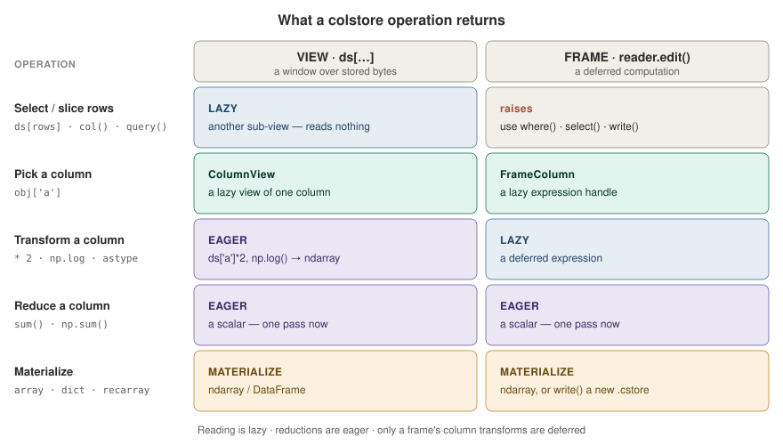
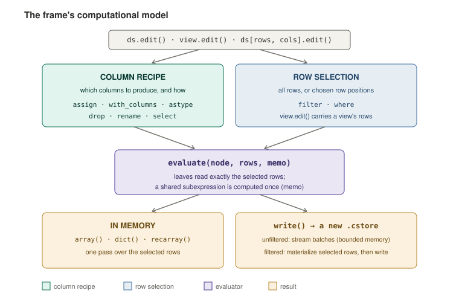
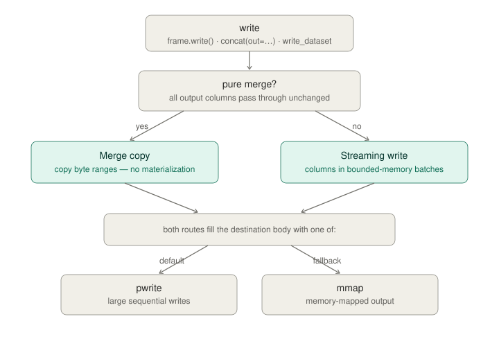
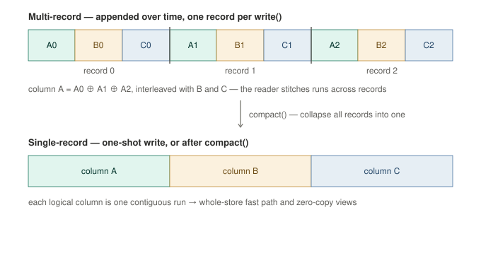
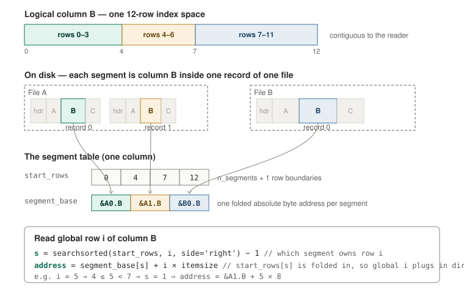

# ColStore

A memory-mapped columnar binary format for fast, memory-efficient I/O on
structured arrays. `colstore` lets you write a tabular dataset to a single
`.cstore` file (in one shot or streamed across many records) and then load
arbitrary row/column subsets without materializing the rest. Internally,
columns are stored back-to-back as raw NumPy bytes, reads use `np.memmap`,
and fancy-index gathers run through a parallel C++ kernel (OpenMP + software
prefetching) bound via Cython. Process memory stays bounded by the size of
the output you ask for; the source file is never fully read into RAM.

**What you get**

- **Single-file or many.** Write one `.cstore`, or open many same-schema files — or a directory of shards — as one logical table.
- **Bounded memory.** Reads are memory-mapped, so process memory tracks the output you ask for, not the file size; files larger than RAM are fine.
- **Fast random access.** Fancy-index and boolean gathers run through a parallel C++/OpenMP kernel, dispatched per access pattern.
- **Lazy reads and edits.** Indexing returns lazy views; `edit()` derives a new file from an existing one without touching the source.
- **Zero-copy where the layout permits.** A compacted, native-byte-order store hands back read-only views of the page cache (`copy=False`).

## Table of contents

- [**Guide**](#guide)
  - [Install](#install)
  - [Quick start](#quick-start)
  - [Reader, writer, frame](#reader-writer-frame)
  - [Eager and lazy operations](#eager-and-lazy-operations)
  - [Filtering and projection](#filtering-and-projection)
  - [Editing](#editing)
  - [Writing](#writing)
  - [Compaction](#compaction)
  - [Multiple files and datasets](#multiple-files-and-datasets)
  - [Introspection](#introspection)
- [**Performance & tuning**](#performance--tuning)
  - [Zero-copy reads](#zero-copy-reads)
  - [Configuration](#configuration)
  - [How reads parallelize](#how-reads-parallelize)
  - [NUMA placement](#numa-placement)
  - [How writes reach disk](#how-writes-reach-disk)
- [**Format & internals**](#format--internals)
  - [On-disk format](#on-disk-format)
  - [The segment table](#the-segment-table)
  - [Supported dtypes](#supported-dtypes)
- [**About**](#about)
  - [Design philosophy](#design-philosophy)
  - [Documentation](#documentation)
  - [License](#license)

## Guide

### Install

```bash
pip install colstore
```

Building from source needs a C++17 compiler and CMake ≥ 3.18. On macOS install
`libomp` (`brew install libomp`) to get the parallel kernel; without it the
build still succeeds but the kernel runs single-threaded.

### Quick start

```python
import colstore

# One-shot write + open. `.cstore` is the canonical extension.
ds = colstore.store(df, "data.cstore")

# Or open an existing file for read.
ds = colstore.open("data.cstore")

# Indexing returns lazy views; no data is read yet.
ds['price']                          # ColumnView
ds[100:200]                          # TableView
ds[100:200, 'price']                 # ColumnView
ds[100:200, ['price', 'qty']]        # TableView
ds[[1, 5, 9], ['price', 'qty']]      # TableView (fancy rows + cols)

# Materialize through one of the materialization methods.
ds['price'].array()                          # 1D ndarray
ds.array('price')                            # 1D ndarray (shortcut for ds['price'].array())
ds[indices, ['price', 'qty']].dict()         # dict of 1D arrays
ds[indices, ['price', 'qty']].recarray()     # structured ndarray
ds[indices, ['price', 'qty']].frame()        # pandas DataFrame
ds[100:200].dict(copy=False)                 # read-only views, no copy (see Zero-copy reads)
ds.head()                                    # peek: a table that renders in notebook + terminal
```

### Reader, writer, frame

colstore has three objects, one per job. Most code only ever needs
`ColStoreReader`.

- **`ColStoreReader`** is the read interface. `colstore.open(path)` returns one;
  index it for lazy views (`ds[rows, cols]`) and materialize with `.array()`,
  `.dict()`, `.recarray()`, or `.frame()`. This is what you use to get data out.
- **`ColStoreWriter`** is the write interface for *new* data. You use it through
  the `colstore.create` / `recreate` / `update` context managers to stream
  records into a file. For a single in-memory dataset there is no need to touch
  it directly — `colstore.store(data, path)` writes a dict, record array, or
  DataFrame in one shot. (See **Writing**, below.)
- **`ColStoreFrame`** is the edit interface. `reader.edit()` returns one; update,
  add, drop, rename, cast (`astype({"pt": "float32"})`), or transform its columns
  — each edit returns a new frame (`inplace=True` to edit in place), so edits
  branch cheaply off a shared base. Then materialize in memory (`array(name)`
  for one column, `dict()` / `recarray()` / `frame()` for all) or `.write(path)` to
  stream the result to a new file. It never modifies the source store.

**Which to use:**

| | Job | Get one from | Output |
|---|---|---|---|
| **`ColStoreReader`** | Read an existing file | `colstore.open(path)` | NumPy arrays / DataFrames, in memory |
| **`ColStoreWriter`** | Write a *new* file from data you hold | `colstore.create` / `recreate` / `update` (context manager) | a `.cstore` on disk |
| **`ColStoreFrame`** | Derive a *new* file from an existing one | `reader.edit()` | a new `.cstore` on disk, plus a reader for it |

The distinction people miss is **writer vs. frame**: a writer persists data you
are already holding in memory, while a frame derives a new file from one already
on disk by transforming its columns. Starting from raw arrays, reach for a writer
(or `store`); starting from a `.cstore` you want a modified copy of, reach for
`edit()`, which gives you a frame.

### Eager and lazy operations

A reader/dataset and a frame are complementary surfaces, and three rules cover when
colstore reads data and when it defers the work:

- **Reading is lazy.** Indexing, filtering, and projecting a reader return a **view**
  (`ColumnView` / `TableView`) that holds no data; `edit()` returns a **frame**, a
  deferred column-expression graph. Neither reads until you materialize (`array()` /
  `dict()` / `recarray()` / `frame()`, or `np.asarray`) or `write()`.
- **The reader is eager; the frame is lazy.** On a reader/view, work happens now:
  **select rows by a column predicate with `col()` or `query()`** (or positionally with
  `ds[rows]`) — each gives a lazy view — and compute on a column with operators or NumPy
  ufuncs (`ds['a'] * 2`, `np.log(ds['a'])`), which materialize the selected rows into an
  `ndarray`. A frame (`reader.edit()`) defers instead: `frame['a'] * 2` builds an
  expression realized on materialize / `write()`, and it filters with `where()` and
  projects with `select()` rather than indexing rows (`frame[rows]` raises).
- **Reductions are eager everywhere.** `sum` / `mean` / `min` / `max` / `count`, and
  the NumPy spelling `np.sum(column)`, run one bounded-memory pass and return a scalar
  right away, on a view or a frame alike.



So pick the surface by the job: **read and compute now on the reader**
(`ds[col('x') > 0, 'a'] * 2` selects rows by a predicate, then computes, eagerly), or
**build a deferred transform** that composes and writes without materializing **on a
frame** (`reader.edit()`). Either way, a reduction (`column.sum()`) gives a scalar now.

### Filtering and projection

Filter rows with a predicate **string** or a composable **`col()`
expression** — both return a **lazy view**. Nothing is read until you
materialize: the predicate columns are read (and the row mask computed) on the
first `.evaluate()` / `.frame()` / `.dict()` / `.recarray()` / `.array()`, and the
selected columns only when you ask for them.

```python
from colstore import col

# String form (parsed and validated eagerly, evaluated lazily):
hot = ds.query("energy > 100 and -2.5 < eta < 2.5")     # lazy TableView
hot.frame()                                              # read + materialize now
ds.query("pt > @cut and region == 'SR'", params={"cut": 30}).dict()

# col() form (composable; stacks with & | ~ and stays lazy):
ds[(col("pt") > 30) & (col("region") == "SR")].frame()
ds.where(col("pt").isin([30, 40, 50]))                  # the explicit verb
ds[col("pt") > 30, ["pt", "eta"]].recarray()            # project columns

# select() / drop() project columns by exact name -- chainable, stays lazy:
ds.select("pt", "eta")                                  # lazy view of those columns
ds.drop("weight")                                       # all columns except weight
ds.query("pt > 30").select("eta")                       # filter rows, then project
```

**Lazy by default; `evaluate()` to peek.** `query()` and `ds[expr]` defer
everything; call `.evaluate()` (or `query(..., lazy=False)`) to resolve the row
mask now — it reads the predicate columns and returns a view whose rows are
fixed, so a following `.frame()` / `.dict()` doesn't recompute the selection. The
selected columns are still materialized only on demand.

**Projection.** `select(*names)` / `drop(*names)` choose columns by **exact name**
— no wildcards, so column selection stays explicit and unambiguous. Both return a
lazy `TableView`, preserve the row selection, and chain with `query()` / `col()`;
`select` keeps the order you give and rejects duplicates, and an unknown name
raises `KeyError` immediately. A single `select("x")` is still a one-column
`TableView` — use `ds["x"]` for a 1-D `ColumnView`.

The string grammar is a strict whitelist evaluated **without `eval`**: column
names, numeric/string/bool literals, comparisons (including chained `a < x < b`),
the boolean operators (`and` / `or` / `not` and `& | ~` — parenthesize the
bitwise forms, which bind tighter than comparison), arithmetic, and `in` /
`not in`. `@name` resolves from `params` (the calling frame is never inspected),
and a bool column is a predicate on its own (`ds.query("is_signal")`). `col()`
expressions combine with `& | ~` and `.isin(...)` (Python's `and` / `or` / `not`
can't be overloaded). An unknown column, an unsupported construct, or a
non-boolean condition raises `colstore.QueryError` immediately, reading no data.
Everything behaves the same on a single file and a multi-file dataset.

### Editing

`reader.edit()` returns a `ColStoreFrame`: a lazy specification of a new file,
read only when you materialize it. A frame has two independent parts — the
**columns** to produce (each an expression over the source columns) and the
**rows** to keep — and nothing touches disk until you ask for the result, in
memory with `array(name)` / `dict()` / `recarray()`, or as a new file with
`write()`. Every edit returns a new frame, so frames branch cheaply from a shared
base; pass `inplace=True` to edit one in place.

```python
import numpy as np
from colstore import col

cf = ds.edit()                                   # a frame over every column, all rows
cf = cf.assign(ratio=col("close") / col("open")) # col() builds a column value...
cf = cf.where(col("ratio") > 1.0, "gains")       # ...and the same col() selects rows (lazy; name the cut)
cf = cf.where("volume > @v", params={"v": 1e6})  # a query string works too; where()s compose
cf = cf.astype({"open": "float32"}).drop("noise")
cf = cf.select("close", "open", "ratio")         # project columns; filter() aliases where()

cf.n_rows                                        # how many rows the frame selects (resolves it)
cf.report()                                      # cutflow per named cut (raw / weighted / both)
cf.dict(); cf.recarray(); cf.array("ratio")      # materialize the selected rows in memory
cf.sum("ratio"); cf.mean("pt"); cf.max("eta"); cf.count()   # full-pass scalar reductions
for batch in cf.iter_batches("256 MiB"):  ...    # or stream bounded in-memory frames (any format)
reader = cf.write("derived.cstore")              # or write a new .cstore (returns a reader)

# A filtered or gathered view continues straight into an edit:
hot = ds.query("pt > 30").edit()                 # a frame over only the matching rows
hot.assign(logpt=np.log(hot["pt"])).write("hot.cstore")
ds[indices].select("pt", "eta").edit()           # a fancy index, slice, or mask carries over
```

The columns form an expression graph: stored columns, expressions over them, and
constants combined by elementwise operators and NumPy ufuncs. Only
**row-independent** transforms are representable — each output row depends only on
the input row at the same position — so reductions and sorts are rejected when the
frame is built. The same `col()` expression builds a value (`assign`) or a row
predicate (`where`); either way its names resolve against the frame's columns **in
order**, so a column derived or renamed earlier is what a later step sees. Every
column derives from the same base and stays the same length, so `assign` takes an
expression (or a column from another frame); a raw array attaches only at the base,
before any selection.

`where` (alias `filter`) is **lazy** — it records the predicate and evaluates it
only on materialization. A frame doesn't slice or index rows/columns — that's the
reader's job (view a written file); the frame filters with `where`, projects with
`select`, and edits with `assign`. `n_rows` is the source or selected count; a pending
predicate is resolved on access (an O(n) scan). Materializing evaluates each column
over the selected rows, sharing a subexpression once. Both `iter_batches` and `write()`
are **bounded in memory**: they resolve the selection once, then process the selected
rows one batch at a time (`batch_size` / `memory_budget` — an `int` row count or an IEC
string like `"256 MiB"`), so a filtered frame streams its survivors rather than
materializing them whole. `iter_batches` yields each batch as a **materialized,
in-memory frame** (columns detached from the source), so the consumer converts it to any
format — `dict()`, `recarray()`, `write()`, or further edits.

A `where`/`filter` cut can be **named** and **weighted** — `where(col("pt") > 30, "trigger",
weight="w")` — and `report()` returns the **cutflow**: the rows entering and passing each cut,
in order, with efficiencies, and the summed weight too when one is in effect (a weight is sticky
across later cuts). `report(show=...)` prints `"raw"`, `"weighted"`, or `"both"`; the report
renders as a table in a terminal and as HTML in a notebook, and `report().records()` returns
the cutflow as a list of per-cut dicts for saving (JSON, CSV, …). Unnamed cuts appear by
position.



The [expression-graph diagram](docs/assets/edit_expression_graph.svg) details the
shared-subexpression reuse; the [edit lifecycle](docs/assets/edit_lifecycle.svg) and
[streaming commit](docs/assets/edit_streaming_commit.svg) diagrams trace a frame from
`edit()` to a written file.

### Writing

`colstore.store(data, path)` is the one-shot path; it dispatches on the
input type:

```python
import colstore
import numpy as np

# From a dict of 1D arrays.
colstore.store(
    {"x": np.arange(100, dtype=np.float32), "y": np.arange(100, dtype=np.int64)},
    "data.cstore",
)

# From a structured (record) array.
records = np.empty(100, dtype=[("price", np.float32), ("qty", np.int32)])
colstore.store(records, "data.cstore", mode="recreate")

# From a pandas DataFrame.
colstore.store(df, "data.cstore", mode="recreate")
```

`mode="create"` (default) refuses to overwrite; `mode="recreate"` truncates
an existing file.

For multi-record streaming writes (data arriving in batches, or appending
to an existing file), use `colstore.create` / `colstore.recreate` /
`colstore.update`:

```python
# Append-only stream into a new file.
with colstore.create("data.cstore") as f:
    for batch in source:
        f.write({"x": batch.x, "y": batch.y})

# Resume appending to an existing file. Schema is loaded from the manifest
# and every write must match it. Bytes from a crashed prior writer are
# truncated on open.
with colstore.update("data.cstore") as f:
    f.write({"x": more_x, "y": more_y})
```

The writer commits records atomically on `close()` by rewriting a 64-byte
counters block. A reader opening the file mid-write sees only what the
last successful close committed.

The streaming writers (`create` / `recreate` / `update`) and `compact` take an
advisory `flock` for the duration of the write, so a second writer on the same
file fails fast with a clear error instead of corrupting it. On filesystems that
don't implement `flock` (some networked or parallel filesystem mounts), the lock is skipped
with a one-time warning and the write proceeds — there is no lock to contend for
on such a mount, so concurrent-writer detection is simply unavailable there.

### Compaction

A streaming write produces one record per `write()` call. Reads of
slice and sorted-fancy index patterns scale near-flat with record count,
but unsorted-fancy reads degrade as records accumulate. `colstore.compact`
collapses all records into one, so every read pattern takes the
single-record fast path:

```python
colstore.compact("data.cstore")                 # in-place
colstore.compact("data.cstore", out="new.cstore")  # leave source untouched
```

In-place compaction writes to a sibling temp file and atomically renames
into place; the source is untouched on failure. The byte copy uses
`os.sendfile` on Linux (kernel-space copy, no Python-side surfacing)
and `shutil.copyfileobj` on macOS/Windows; on both paths memory
footprint is bounded by the kernel/I/O buffer (tens of KB) regardless
of file size — files much larger than RAM compact fine.

### Multiple files and datasets

A run is often split across many same-schema `.cstore` files. Open them as one
logical table — every read decomposes across the files and is stitched back
together, with no data copied:

```python
ds = colstore.open(["jan.cstore", "feb.cstore", "mar.cstore"])  # a ColStoreDataset
ds.n_rows                                  # sum of the files
ds[1_000:2_000, ["price", "qty"]].dict()   # slices span the files transparently
ds[[5, 1_000_000, 7], "price"].array()     # fancy and boolean selection too
```

The result is a `ColStoreDataset`. It is empty-constructible and growable, and
takes a mix of paths (which it opens and *owns*) and already-open readers or
datasets (which it *borrows* and leaves open):

```python
from colstore import ColStoreDataset

ds = ColStoreDataset()                       # empty; grow it later
ds.append("jan.cstore")                      # opens and owns this file
ds.append(existing_reader)                   # borrows an open reader
ds |= another_reader                         # in-place combine (borrows)

combined = reader_a | reader_b | reader_c    # combine open readers into one dataset
```

A dataset supports everything a single-file reader does — indexing, the lazy
views, `dict()`/`recarray()`/`frame()`, and `edit()` — by delegating to the
per-file readers, so the tuned single-file gather path is reused unchanged; a
one-file dataset costs the same as the bare reader. Closing a dataset closes
only the files it opened, so readers you passed in stay open and remain yours to
close.

To materialize the combination as one physical file, use `concat`:

```python
# Lazy: a dataset over the files, no copy — the same as open([...]).
ds = colstore.concat(["jan.cstore", "feb.cstore"])

# Eager: stream the combined data into one new file, in bounded memory.
reader = colstore.concat(["jan.cstore", "feb.cstore"], out="q1.cstore")
```

The written file reads back on the single-record fast path. See the [dataset
read decomposition](docs/assets/dataset_read_decomposition.svg) diagram for how a read
is split across files and reassembled.

#### Growing a dataset by appending

A dataset can also *be* a directory, grown one piece at a time. Each new piece is
written as its own immutable `.cstore` *shard*, and the directory's contents are
the dataset — `open(dir)` reads every shard in order, the same as `open([...])`
over a list:

```python
colstore.append("trades/", jan)            # writes trades/shard_00000.cstore
colstore.append("trades/", feb)            # writes trades/shard_00001.cstore

ds = colstore.open("trades/")              # the whole directory as one table
ds.n_rows                                  # sum across every shard
```

`append` writes only the new rows, so extending a large dataset stays cheap no
matter how big it already is — unlike re-running `concat` to a single file, which
rewrites everything each time. There is nothing to keep in sync by hand: add a
shard and it is in the dataset; remove one and it is gone. New shards take the
next free `shard_{index:05d}.cstore` name; pass `name=` to choose another
template (any `{index}` field) or a fixed filename.

To stream many batches without holding them all in memory, use `appender`, which
rolls a new shard each time the buffer reaches a size budget (a row count, a byte
string like `"256 MiB"`, or `None` to roll only on an explicit `flush()`):

```python
with colstore.appender("trades/", shard_size="256 MiB") as out:
    for batch in source:
        out.write(batch)                   # buffered; rolls a shard at the budget
# the remainder is flushed and the shard committed on exit
```

Every shard must share the schema of the ones already there, and is committed
atomically — a reader only ever sees a complete shard, and an interrupted write
leaves nothing behind. One writer holds the directory at a time. Pass
`statistics=True` (to either `append` or `appender`) to record per-record
min/max bounds in each shard, so a later filtered read can skip shards that
cannot match.

### Introspection

```python
i = colstore.info("data.cstore")
# ColStoreInfo(path='data.cstore', n_rows=1_000_000, n_records=42,
#              columns=[a:<f4, b:<i8], file_size=8_001_232B,
#              needs_compaction=True)

colstore.schema("data.cstore")
# [{'name': 'a', 'dtype': '<f4', 'encoding': 'raw', 'nullable': False}, ...]
```

Both `info` and `schema` read only the file header (no record bodies are
scanned), so they're cheap on multi-GB files.

## Performance & tuning

### Zero-copy reads

Materializing a whole store normally copies every column out of the mapping into
fresh arrays — doubling peak memory and reading+writing every byte before you
touch it. When the layout allows it, `copy=False` instead returns **read-only
views over the page cache itself**:

```python
ds = colstore.open("data.cstore")                  # ideally compacted first
d = ds.dict(copy=False)                            # read-only ndarrays backed by the mmap
total = d["energy"].sum()                          # computed straight from page-cache bytes

ds["price"].array(copy=False)                      # one read-only column
ds[100:200, ["price", "qty"]].frame(copy=False)    # a read-only DataFrame aliasing the mmap
```

`copy=False` is a **guarantee, not a hint**: it returns a real view or raises —
never a silent copy. It is supported exactly when the store is **single-record**
(`colstore.compact` produces these), the dtype is **native byte order**, and the
selector is whole-store / an int / a slice of any step. A fancy or boolean
selector needs a gather, which by definition copies, so it raises `ValueError`
with the remedy; the whole-table forms are all-or-nothing and never return a mix
of views and copies.

`array`, `dict`, and `frame` all take `copy=False`; `recarray` always repacks
(it interleaves the columns into one record buffer) and so ignores it. View
creation is O(1) in column size and **halves peak resident memory** — the data
stays page-cache-backed and reclaimable instead of committed to a second buffer.
Views pin the mapping, so they stay valid after `ds.close()`. Because the views
are read-only they cannot corrupt the store; use the default `copy=True` when you
need to mutate. The full contract is in
[Performance &amp; internals](docs/guide/performance.md) §7.

### Configuration

```python
from colstore import (
    set_max_workers,
    set_default_madvise,
    set_default_backend,
    set_gather_thread_cap,
    calibrate,
)
from colstore import config

set_max_workers(8)                 # parallel gathers across columns
set_default_madvise("sequential")  # OS read-ahead hint for sorted-index reads
set_default_backend("cpp")         # gather kernel: cpp | numpy | numba
set_gather_thread_cap(16)          # threads per gather (default scales with socket count)
config.set_numa_policy("auto")     # page placement: auto (interleave on multi-node) | local
config.set_write_method("auto")    # write fill: auto (pwrite where available) | pwrite | mmap
config.set_preview_rows(20)        # rows shown by head()/tail() and the Jupyter repr (default 10)
config.set_preview_precision(4)    # decimal places shown for floats in a preview (default 6)
config.set_preview_memory_limit(512 * 1024 * 1024)  # warn before a larger head()/tail()
calibrate()                        # one-time: measure the thread/prefetch knees for this host
```

In a notebook, displaying a reader, dataset, or concrete view renders a small
preview table (`_repr_html_`); a still-lazy `query()` / `col()` view shows a
compact card instead, since previewing it would have to read its predicate
columns. `ds.head(n)` / `ds.tail(n)` return a `Preview` that renders as an HTML
table in a notebook and a plain-text table in a terminal; indexing and array
attributes (`.shape`, `.values`, `head["pt"]`) delegate to the underlying numpy
data. On a filtered view, `ds.query(...).head()` previews the matching rows. The
default row count and the size at which a preview warns are the `config`
settings above.

### How reads parallelize

A gather's thread count is decided in two stages. A single-column read runs at
the full gather thread cap; a multi-column read (`dict` / `recarray` / `frame`)
either splits the cap across a per-column pool or runs the columns sequentially
at the full cap, depending on the route taken. Either way the kernel's
`resolve_thread_count` has the final say: it scales the actual thread count with
the number of indices and clamps it to the cap, so small reads stay serial and
only large ones spend the whole budget.


The cap itself defaults to half the physical cores, bounded by a per-socket
allowance so multi-socket hosts (with more memory channels) get a higher
default; `colstore.calibrate()` refines it per host by measuring the saturation
knee directly.

### NUMA placement

On a multi-node (multi-socket) Linux host, the default `auto` policy interleaves
a store's pages across nodes so the memory controllers share the load; on a
single-node host, or under `local`, it leaves the kernel's first-touch placement
that keeps pages near the reading thread. Placement is decided at the first page
fault, so warm pages cannot be moved — only a cold read (pages not yet resident)
is placed according to the policy.


Whether the best cold-read placement depends on the access pattern was the one
case the warm sweep never covered. `benchmark/check_cold_read_placement.py`
measured it on a multi-node host: cold, across contiguous, sorted-fancy, and
random-scatter selectors, interleave was at least as fast as local for every
pattern (1.10× on the contiguous scan, within noise otherwise) and never
slower. The winner never flips to local, so there is nothing for a per-pattern
mechanism to exploit and the single `auto` default stands. Revisit only if a
host or access pattern is found where local beats interleave for cold reads.

Pinning the gather threads (rather than placing pages) is a separate, opt-in
lever that ships **off**: a placement × binding × cap sweep measured spread
binding 24–51% slower on a multi-node host, so `gather_binding` defaults to off
and the realized path is the unbound default pool.


### How writes reach disk

Every write — `frame.write()`, `concat(..., out=...)`, `write_dataset` — chooses
a path and a fill method:



A write takes the **merge copy** route only when every output column is an
unchanged on-disk passthrough — a same-schema `concat` with no edits, say; any
transform, added, dropped, or renamed column, in-memory or constant column, or
single source routes through the **streaming write** instead.

**Why the fill method matters.** An `mmap`'d output is dirtied one page at a
time; a parallel filesystem serves that pattern poorly — a 1 GB write faults
~250k pages and runs at a fraction of the device's bandwidth. `pwrite` issues
large contiguous writes instead, which such filesystems serve well: measured ~2×
faster for the streaming write and ~4× for the merge copy on a parallel
filesystem (zero page faults vs ~250k), and faster node-local too. `pwrite` is
therefore the default wherever `os.pwrite` exists; `mmap` remains the fallback on
Windows.

**Controlling it.** The default (`auto`) is right on every filesystem measured so
far. Override only to force a method — to reproduce the `mmap` path, or on a
platform where it is faster:

```python
from colstore import config

config.set_write_method("pwrite")  # auto (default) | pwrite | mmap
```

The merge copy reuses the gather thread budget to copy its byte ranges in
parallel; the streaming write fills one batch at a time within the configured
memory budget. Output is byte-identical across every method.

## Format & internals

### On-disk format


```
[magic 8B = b"CSTORE\x00\x01"]
[counters 64B: n_records(8) + committed_rows(8) + stats_offset(8) + crc32(4) + reserved(36)]
[manifest_len 8B (u64 little-endian)]
[manifest_json: format_version + columns + manifest_crc32]
[zero-padding to 64-byte alignment]
[record_0 header 32B][record_0 body, padded to 8B]
[record_1 header 32B][record_1 body, padded to 8B]
...
```

The JSON manifest is immutable and carries only the schema; the mutable
record/row counters live in their own fixed-position 64-byte block (with
its own CRC) right after the magic. Each record body holds the columns
back-to-back as raw bytes. A one-shot write produces a single-record file
that reads via a per-column memmap fast path; a streamed write produces a
multi-record file with per-pattern dispatch (contiguous range, sorted
fancy, unsorted fancy).



### The segment table

A logical column is one contiguous index space to the reader, but on disk its
bytes are scattered: a multi-record file holds one run of the column per record
(interleaved with the other columns), and a multi-file dataset spreads those
runs across files. Reads bridge that gap with a **segment table**, the one
structure the mask and fancy-gather kernels address through.

A **segment** is one column's run inside one record of one file — the smallest
unit that is contiguous on disk. The table is two `int64` arrays per column:

- `start_rows` — the `n_segments + 1` cumulative row boundaries, so segment `s`
  owns global rows `[start_rows[s], start_rows[s + 1])`.
- `segment_base` — one **folded absolute byte address** per segment. It bakes in
  the file's mapping base, the record's body offset, this column's prefix within
  the record, and the segment's row origin, so that the value at global row `i`
  is simply `segment_base[s] + i * itemsize`. The `start_rows[s]` shift is folded
  into the base, so the *global* row index plugs in directly — no per-segment
  rebasing in the inner loop.

To read global row `i`: binary-search `start_rows` for its segment `s`, then read
at `segment_base[s] + i * itemsize`.



The encoding is the same whichever way the rows are split, which is why one
kernel serves every case: a **single-file multi-record** store is the records of
one file; a **multi-file dataset** stitches every file's records into one global
table (`ColStoreDataset` memoizes it per column, since it depends only on the
column and the mappings, not the rows a read requests). A single-record file is
the degenerate case — one segment over the column's own memmap.

### Supported dtypes

All fixed-size NumPy dtypes are supported: `float32`/`float64`,
`int8/16/32/64`, `uint8/16/32/64`, `bool`, `datetime64`, `timedelta64`,
and fixed-width strings (`S` bytes and `U` unicode, with the width baked
into the dtype, e.g. `S16` or `U8`). Object dtype (variable-length
strings, Python objects) is rejected at write time — the design point is
zero-copy random access, which requires a fixed stride per row.

## About

### Design philosophy

A few choices shape everything above:

- **Load and write, not stream-compute.** colstore persists a structured array
  and reads arbitrary row/column subsets back fast; it is not a query engine.
  Reads are memory-mapped, so process memory stays bounded by the output you ask
  for, never the file size.
- **Speed first, on the hardware that matters.** The hot paths — every
  access-pattern gather, the SoA→AoS record interleave, the contiguous and merge
  copies — run in C++/OpenMP kernels bound through Cython, dispatched per pattern
  (contiguous range, strided, sorted/unsorted fancy, boolean mask). Performance is
  judged on multi-socket, multi-NUMA compute nodes; wheels stay portable (no
  `-march=native`), with per-host calibration of the thread cap and prefetch
  distance.
- **No optimization ships without measurement.** Every change is gated by an
  interleaved A/B against the path it replaces, asserted output-identical, and
  carries a committed `benchmark/check_*.py`. Rejected and deferred alternatives
  are recorded with the measurement that closed them and a named reopen condition
  (see the [optimization series](docs/development/optimization_series.md)), so an idea is not
  relitigated without new evidence.
- **Zero-copy where the layout permits.** A compacted, native-byte-order store is
  contiguous on disk, so whole-column reads can hand back read-only views of the
  page cache (`copy=False`) instead of copying. The format is built around a fixed
  stride per row to keep this possible — which is why variable-length object
  dtypes are refused at write time.
- **Correctness is not traded for speed.** Misaligned packed columns load safely
  (UBSan-verified), writes commit atomically via a fixed counters block, a reader
  opening mid-write sees only the last committed state, and `copy=False` is a hard
  guarantee that raises rather than silently copying.

### Documentation

The full documentation — the guides below plus the complete API reference — is
published at [alkaidcheng.github.io/colstore](https://alkaidcheng.github.io/colstore/).
The guides also render in-repo under [`docs/`](docs/):

- [Performance &amp; internals](docs/guide/performance.md) — the file layout, the kernel
  behind each access pattern, how reads parallelize, NUMA placement, and
  zero-copy.
- [Format interop](docs/guide/interop.md) — convert to and from Parquet, Feather,
  JSON, HDF5, NPZ, and ROOT, plus the zero-copy Arrow bridge.
- [Gather diagnostics](docs/development/gather_diagnostics.md) — re-measure the thread,
  binding, and placement knobs on your own hardware.
- [Optimization series](docs/development/optimization_series.md) — the cumulative record of
  every optimization and the measurement behind it.
- [Valgrind leak checking](docs/development/valgrind_leak_checking.md) — the native-leak
  Memcheck harness under `scripts/`.

### License

MIT License - see [LICENSE](LICENSE) file for details.
