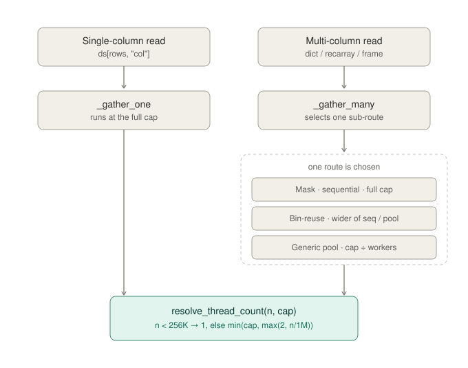
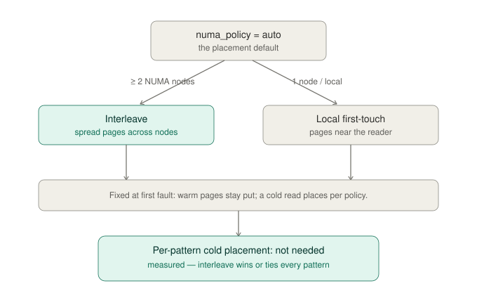
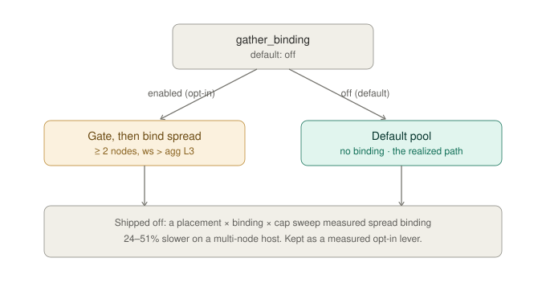
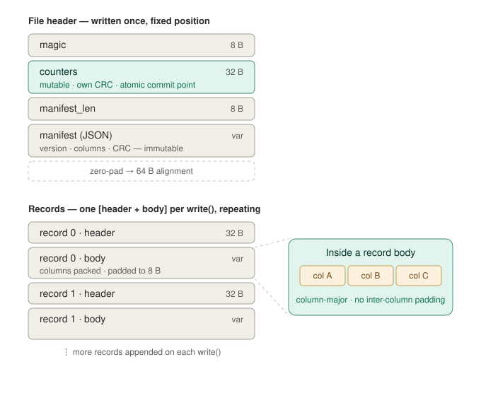

# ColStore

A memory-mapped columnar binary format for fast, memory-efficient I/O on
structured arrays. `colstore` lets you write a tabular dataset to a single
`.cstore` file (in one shot or streamed across many records) and then load
arbitrary row/column subsets without materializing the rest. Internally,
columns are stored back-to-back as raw NumPy bytes, reads use `np.memmap`,
and fancy-index gathers run through a parallel C++ kernel (OpenMP + software
prefetching) bound via Cython. Process memory stays bounded by the size of
the output you ask for; the source file is never fully read into RAM.

## Install

```bash
pip install colstore
```

Building from source needs a C++17 compiler and CMake ≥ 3.18. On macOS install
`libomp` (`brew install libomp`) to get the parallel kernel; without it the
build still succeeds but the kernel runs single-threaded.

## Quick start

```python
import colstore

# One-shot write + open. `.cstore` is the canonical extension.
ds = colstore.store(df, "data.cstore")

# Or open an existing file for read.
ds = colstore.open("data.cstore")

# Indexing returns lazy views; no data is read yet.
ds['price']                          # ColumnView
ds[100:200]                          # TableView
ds[100:200, 'price']                 # ColumnView
ds[100:200, ['price', 'qty']]        # TableView
ds[[1, 5, 9], ['price', 'qty']]      # TableView (fancy rows + cols)

# Materialize through one of the materialization methods.
ds['price'].array()                          # 1D ndarray
ds[indices, ['price', 'qty']].dict()         # dict of 1D arrays
ds[indices, ['price', 'qty']].recarray()     # structured ndarray
ds[indices, ['price', 'qty']].frame()        # pandas DataFrame
```

## Reader, writer, frame: which to use

colstore has three objects, one per job. Most code only ever needs
`ColStoreReader`.

| | Job | Get one from | Output |
|---|---|---|---|
| **`ColStoreReader`** | Read an existing file | `colstore.open(path)` | NumPy arrays / DataFrames, in memory |
| **`ColStoreWriter`** | Write a *new* file from data you hold | `colstore.create` / `recreate` / `update` (context manager) | a `.cstore` on disk |
| **`ColStoreFrame`** | Derive a *new* file from an existing one | `reader.edit()` | a new `.cstore` on disk, plus a reader for it |

- **`ColStoreReader`** is the read interface. `colstore.open(path)` returns one;
  index it for lazy views (`ds[rows, cols]`) and materialize with `.array()`,
  `.dict()`, `.recarray()`, or `.frame()`. This is what you use to get data out.
- **`ColStoreWriter`** is the write interface for *new* data. You use it through
  the `colstore.create` / `recreate` / `update` context managers to stream
  records into a file. For a single in-memory dataset there is no need to touch
  it directly — `colstore.store(data, path)` writes a dict, record array, or
  DataFrame in one shot. (See **Writing**, below.)
- **`ColStoreFrame`** is the edit interface. `reader.edit()` returns one; update,
  add, drop, rename, or transform its columns and call `.write(path)` to stream
  the result to a new file. It never modifies the source store.

The distinction people miss is **writer vs. frame**: a writer persists data you
are already holding in memory, while a frame derives a new file from one already
on disk by transforming its columns. Starting from raw arrays, reach for a writer
(or `store`); starting from a `.cstore` you want a modified copy of, reach for
`edit()`, which gives you a frame.

## Writing

`colstore.store(data, path)` is the one-shot path; it dispatches on the
input type:

```python
import colstore
import numpy as np

# From a dict of 1D arrays.
colstore.store(
    {"x": np.arange(100, dtype=np.float32), "y": np.arange(100, dtype=np.int64)},
    "data.cstore",
)

# From a structured (record) array.
records = np.empty(100, dtype=[("price", np.float32), ("qty", np.int32)])
colstore.store(records, "data.cstore", mode="recreate")

# From a pandas DataFrame.
colstore.store(df, "data.cstore", mode="recreate")
```

`mode="create"` (default) refuses to overwrite; `mode="recreate"` truncates
an existing file.

For multi-record streaming writes (data arriving in batches, or appending
to an existing file), use `colstore.create` / `colstore.recreate` /
`colstore.update`:

```python
# Append-only stream into a new file.
with colstore.create("data.cstore") as f:
    for batch in source:
        f.write({"x": batch.x, "y": batch.y})

# Resume appending to an existing file. Schema is loaded from the manifest
# and every write must match it. Bytes from a crashed prior writer are
# truncated on open.
with colstore.update("data.cstore") as f:
    f.write({"x": more_x, "y": more_y})
```

The writer commits records atomically on `close()` by rewriting a 32-byte
counters block. A reader opening the file mid-write sees only what the
last successful close committed.

The streaming writers (`create` / `recreate` / `update`) and `compact` take an
advisory `flock` for the duration of the write, so a second writer on the same
file fails fast with a clear error instead of corrupting it. On filesystems that
don't implement `flock` (some Lustre, GPFS, and NFS mounts), the lock is skipped
with a one-time warning and the write proceeds — there is no lock to contend for
on such a mount, so concurrent-writer detection is simply unavailable there.

## Compaction

A streaming write produces one record per `write()` call. Reads of
slice and sorted-fancy index patterns scale near-flat with record count,
but unsorted-fancy reads degrade as records accumulate. `colstore.compact`
collapses all records into one, so every read pattern takes the
single-record fast path:

```python
colstore.compact("data.cstore")                 # in-place
colstore.compact("data.cstore", out="new.cstore")  # leave source untouched
```

In-place compaction writes to a sibling temp file and atomically renames
into place; the source is untouched on failure. The byte copy uses
`os.sendfile` on Linux (kernel-space copy, no Python-side surfacing)
and `shutil.copyfileobj` on macOS/Windows; on both paths memory
footprint is bounded by the kernel/I/O buffer (tens of KB) regardless
of file size — files much larger than RAM compact fine.

## Introspection

```python
i = colstore.info("data.cstore")
# ColStoreInfo(path='data.cstore', n_rows=1_000_000, n_records=42,
#              columns=[a:<f4, b:<i8], file_size=8_001_232B,
#              needs_compaction=True)

colstore.schema("data.cstore")
# [{'name': 'a', 'dtype': '<f4', 'encoding': 'raw', 'nullable': False}, ...]
```

Both `info` and `schema` read only the file header (no record bodies are
scanned), so they're cheap on multi-GB files.

## Configuration

```python
from colstore import (
    set_max_workers,
    set_default_madvise,
    set_default_backend,
    set_gather_thread_cap,
    calibrate,
)
from colstore import config

set_max_workers(8)                 # parallel gathers across columns
set_default_madvise("sequential")  # OS read-ahead hint for sorted-index reads
set_default_backend("cpp")         # gather kernel: cpp | numpy | numba
set_gather_thread_cap(16)          # threads per gather (default scales with socket count)
config.set_numa_policy("auto")     # page placement: auto (interleave on multi-node) | local
calibrate()                        # one-time: measure the thread/prefetch knees for this host
```

## How reads parallelize

A gather's thread count is decided in two stages. A single-column read runs at
the full gather thread cap; a multi-column read (`dict` / `recarray` / `frame`)
either splits the cap across a per-column pool or runs the columns sequentially
at the full cap, depending on the route taken. Either way the kernel's
`resolve_thread_count` has the final say: it scales the actual thread count with
the number of indices and clamps it to the cap, so small reads stay serial and
only large ones spend the whole budget.



The cap itself defaults to half the physical cores, bounded by a per-socket
allowance so multi-socket hosts (with more memory channels) get a higher
default; `colstore.autotune` refines it per host by measuring the saturation
knee directly.

## NUMA placement

On a multi-node (multi-socket) Linux host, the default `auto` policy interleaves
a store's pages across nodes so the memory controllers share the load; on a
single-node host, or under `local`, it leaves the kernel's first-touch placement
that keeps pages near the reading thread. Placement is decided at the first page
fault, so warm pages cannot be moved — only a cold read (pages not yet resident)
is placed according to the policy.



Whether the best cold-read placement depends on the access pattern was the one
case the warm sweep never covered. `benchmark/check_cold_read_placement.py`
measured it on a multi-node host: cold, across contiguous, sorted-fancy, and
random-scatter selectors, interleave was at least as fast as local for every
pattern (1.10× on the contiguous scan, within noise otherwise) and never
slower. The winner never flips to local, so there is nothing for a per-pattern
mechanism to exploit and the single `auto` default stands. Revisit only if a
host or access pattern is found where local beats interleave for cold reads.

Pinning the gather threads (rather than placing pages) is a separate, opt-in
lever that ships **off**: a placement × binding × cap sweep measured spread
binding 24–51% slower on a multi-node host, so `gather_binding` defaults to off
and the realized path is the unbound default pool.



## On-disk format



```
[magic 8B = b"CSTORE\x00\x01"]
[counters 32B: n_records(8) + committed_rows(8) + crc32(4) + reserved(12)]
[manifest_len 8B (u64 little-endian)]
[manifest_json: format_version + columns + manifest_crc32]
[zero-padding to 64-byte alignment]
[record_0 header 32B][record_0 body, padded to 8B]
[record_1 header 32B][record_1 body, padded to 8B]
...
```

The JSON manifest is immutable and carries only the schema; the mutable
record/row counters live in their own fixed-position 32-byte block (with
its own CRC) right after the magic. Each record body holds the columns
back-to-back as raw bytes. A one-shot write produces a single-record file
that reads via a per-column memmap fast path; a streamed write produces a
multi-record file with per-pattern dispatch (contiguous range, sorted
fancy, unsorted fancy).


## Supported dtypes

All fixed-size NumPy dtypes are supported: `float32`/`float64`,
`int8/16/32/64`, `uint8/16/32/64`, `bool`, `datetime64`, `timedelta64`,
and fixed-width strings (`S` bytes and `U` unicode, with the width baked
into the dtype, e.g. `S16` or `U8`). Object dtype (variable-length
strings, Python objects) is rejected at write time — the design point is
zero-copy random access, which requires a fixed stride per row.

## Documentation

In-depth guides live in [`docs/`](docs/):

- [Performance &amp; internals](docs/performance.md) — the file layout, the kernel
  behind each access pattern, how reads parallelize, NUMA placement, and
  zero-copy.
- [Gather diagnostics](docs/gather_diagnostics.md) — re-measure the thread,
  binding, and placement knobs on your own hardware.
- [Optimization series](docs/optimization_series.md) — the cumulative record of
  every optimization and the measurement behind it.
- [Valgrind leak checking](docs/valgrind_leak_checking.md) — the native-leak
  Memcheck harness under `scripts/`.

The [docs index](docs/README.md) lists everything, including the diagrams.

## License

MIT License - see [LICENSE](LICENSE) file for details.
