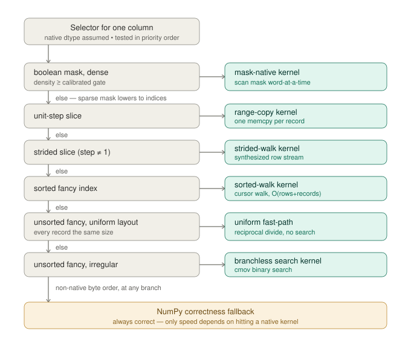

# colstore — Performance & Internals Guide

*How colstore stores columnar data, the implementation behind each fast path, and
how to get the most out of it.*

---

## 1. What colstore is

colstore is a memory-mapped columnar binary format for structured-array
datasets. You hand it columns of NumPy data, it writes them to a single
`.cstore` file, and it reads them back — whole, sliced, or filtered — at close to
the memory bandwidth of the machine. It targets **load-and-read workloads**:
datasets written once (or appended in batches) and then read many times, usually
a few columns at a time, often with a row filter.

Three design commitments shape everything below:

- **Columnar and memory-mapped.** Each column is stored contiguously and read
  through an `mmap` (`mode="r"`), so the OS page cache does the buffering and a
  read touches only the columns and rows you ask for.
- **Native kernels under a NumPy-shaped API.** The gather and copy paths are
  C++/OpenMP kernels bound through Cython. You call `ds.dict()` or
  `ds[mask, "energy"].array()`; underneath, the access pattern you expressed is
  matched to a kernel written for exactly that shape.
- **Speed first, measured, with no-regression floors.** Every fast path was
  validated on the deployment target (dual-socket many-core AMD EPYC, multiple
  NUMA nodes) with paired A/B timing, and every routing decision falls back to
  the simple path when the fast one would not actually win for your data.

### The file format

A `.cstore` file opens with a validated header — an 8-byte magic constant
(`b"CSTORE\x00\x01"`), a format version, a checksum, and a size — followed by the
column **manifest** (names, dtypes, reserved encoding/nullable keys) and the
**record bodies**.


A *record* is a batch of rows. Inside a record, the columns are laid out
**column-major and packed**: all of column 0's values for that record, then all
of column 1's, and so on, with **no inter-column padding**. A file written in one
shot, or run through `colstore.compact(...)`, is a **single-record** file: each
logical column is one contiguous run on disk, which is what makes whole-store
reads and zero-copy possible. A file appended to over time is **multi-record**:
the same logical column is split into one run per record, interleaved on disk
with the other columns, and the reader stitches across record boundaries.


```python
import numpy as np
import colstore

rng = np.random.default_rng(0)
columns = {
    "energy":   rng.random(2_000_000),
    "px":       rng.standard_normal(2_000_000),
    "track_id": np.arange(2_000_000, dtype="i8"),
}
ds = colstore.store(columns, "events.cstore")   # one-shot write, returns an open reader

allcols  = ds.dict()                             # {name: ndarray}
energy   = ds["energy"].array()                  # one column
window   = ds[100_000:200_000, "px"].array()     # contiguous range
selected = ds[track_id_list, ["energy", "px"]].dict()   # fancy, multi-column
hot      = ds[ds["energy"].array() > 0.9, "px"].array() # boolean mask
```

Everything from here is about what happens *inside* those read calls.

---

## 2. The mental model: reads are latency-bound

One fact explains nearly every design choice: **a gather is limited by memory
latency and bandwidth, not by arithmetic.**

Reading scattered rows from a 1 GB column is dominated by cache misses — each
random DRAM access costs ~100 ns, during which the core could have run hundreds
of instructions. The work of *figuring out which byte to read* (a search, an
address computation) is, ideally, hidden under that wait. The work of *reading
it* is the wall you cannot move.

This has four consequences colstore is built around:

- **More threads stop helping early.** Bandwidth saturates at a small core count,
  long before you run out of cores.
- **Cheap arithmetic is free; serializing ops are not.** A multiply-add overlaps
  the outstanding load. A 64-bit integer **division** stalls the pipeline for
  20–40 cycles that cannot overlap. Removing one such op can beat removing ten
  cheap ones.
- **Extra passes are the real cost.** Copying a column, converting a mask to
  indices, consolidating a DataFrame — each re-reads and re-writes bytes you have
  already touched. Avoiding a whole pass beats speeding one up.
- **Prefetching can backfire.** An out-of-order core already keeps many requests
  in flight; manual prefetch can be pure overhead.

The strategies below fall into five families: **the addressing model** that makes
arithmetic gathers possible, **right-sizing parallelism**, **a kernel for every
access pattern**, **replacing memory traffic with arithmetic**, **eliminating
copies**, and **adapting to the hardware**.

---

## 3. The addressing model

Every fast kernel rests on one thing: colstore can compute the byte address of
any cell *arithmetically*, from a handful of small, cache-resident metadata
arrays, without walking the data. Understanding this formula makes the rest of
the kernels obvious.

For a multi-record store the reader holds four arrays, each of length `R` or
`R+1` for `R` records (all tiny — a few kilobytes — and hot in cache):

| Array | Meaning |
|---|---|
| `record_starts_rows` (R+1) | cumulative row count at each record boundary — the prefix sum of rows-per-record |
| `record_starts_bytes` (R+1) | byte offset of each record body in the file |
| `n_rows_per_record` (R) | rows in each record |
| `col_prefix_bytes` (per column) | summed itemsize of the columns *before* this one in a record body |

To read logical row `idx` of a column whose element size is `itemsize`:

```
1.  r = the record containing idx                        # which record?
        = largest r with record_starts_rows[r] <= idx    # binary search, or arithmetic
2.  record_base[r] = record_starts_bytes[r]              # start of record r's body
                   + col_prefix_bytes * n_rows_per_record[r]   # skip earlier columns
                   - record_starts_rows[r] * itemsize    # rebase row numbering to this record
3.  address = base + record_base[r] + idx * itemsize     # the byte to load
```

Step 1 is the only part that varies by access pattern, and it is where all the
routing happens:

- For a **sorted** index or a **slice**, `r` only ever increases — so instead of
  searching per row, a kernel walks a *cursor*: advance `r` when `idx` crosses
  `record_starts_rows[r+1]`. That is O(rows + records).
- For an **unsorted** index, each row needs its own lookup — a binary search over
  `record_starts_rows`.
- For a **uniform-layout** file (every record the same size), `r = idx /
  rows_per_record` in closed form — no search at all.

`record_base[r]` is invariant across all rows of record `r`, which is why kernels
hoist it: compute it once when the cursor crosses into a record, then the inner
loop is just `base + record_base[r] + idx*itemsize`. (Single-record stores are
the degenerate case: `R = 1`, every column is one contiguous run, and the address
is simply `base + idx*itemsize`.)

---

## 4. Right-sizing parallelism

colstore picks its own thread count per call, from the size of the work, so the
default is right on a laptop and a 256-core node alike.

**Work-proportional threading.** Two compiled constants govern it:
`PARALLEL_THRESHOLD = 2^18` (262 144 elements) and `ELEMENTS_PER_THREAD = 2^20`
(1 048 576). Below the threshold a gather runs serially — fork/join would cost
more than the work. Above it, the thread count is roughly `ceil(n /
ELEMENTS_PER_THREAD)`, clamped to a cap. The cap defaults to `physical_cores //
2`, bounded by a per-socket allowance — 8 threads per socket, the point a single
socket's memory channels saturate — so a single-socket host stays near 8 while a
dual-socket host reaches ~16. (Socket count, not NUMA-node count, sets the
ceiling: a NUMA-per-socket BIOS setting inflates the node count for unchanged
memory hardware.) `calibrate()` measures the true knee per host — sweeping up to
32 so a wide host's optimum is bracketed, not clipped — and overrides the
default.

**Splitting the budget across columns.** A multi-column read runs columns
concurrently on a thread pool *and* threads each column's kernel. To avoid
multiplying (`N` columns × full cap), the cap is divided: `per_column_cap =
max(1, cap // n_workers)`. Many columns ⇒ parallelism from the pool, each kernel
near-serial; few columns ⇒ parallelism inside the kernel. The thread product is
bounded by the cap by construction.

```python
import colstore
colstore.get_gather_thread_cap()    # resolved cap for this machine
colstore.set_gather_thread_cap(8)   # override
colstore.set_max_workers(4)         # cap the column pool
```

---

## 5. A kernel for every access pattern

The reader inspects your selector and dispatches to a kernel written for that
exact shape. The decision happens in two layers — single-column
(`_gather_one`) and multi-column (`_gather_many`) — and resolves in a definite
order. Here is the single-column multi-record decision tree, in priority order:

```
boolean mask, native dtype, density >= gate   -> mask-native kernel
boolean mask, otherwise                        -> lower to indices (flatnonzero), continue
unit-step slice                                -> per-record memcpy (range-copy kernel)
strided slice (step != 1), native dtype        -> strided walk kernel (no index array)
fancy index, sorted, native dtype              -> sorted walk kernel
fancy index, unsorted, native, uniform layout  -> uniform fast-path kernel
fancy index, unsorted, native, irregular       -> branchless search kernel
non-native byte order  (any of the above)      -> NumPy correctness fallback
```



Each native kernel takes the metadata arrays from §3 plus the column's
`col_prefix_bytes` and `itemsize`, runs OpenMP across its output, and writes
directly into the caller's output buffer (no intermediate allocation). The rest
of this section is what each one actually does.

### 5.1 Contiguous range — one memcpy per record

`ds[a:b, "c"]` with unit step. The kernel binary-searches the record holding
row `a`, then issues one `memcpy` per spanned record (clipping the first and last
to the requested range), advancing the record cursor as it goes. It is
**deliberately serial**: `memcpy` already runs at memory bandwidth, so threading
it adds only overhead. The win over the old per-record Python loop is large on
many-small-record files and converges to ~1× (no regression) on few-large-record
files.

### 5.2 Strided range — synthesize the row stream

`ds[a:b:s, "c"]` with `step != 1`. There is **no index array at any point**: the
kernel generates the row number for output slot `i` arithmetically as `start +
i*step`, in either direction, and advances the record cursor monotonically
(forward for positive step, backward for negative). One kernel serves both
directions — for a fixed step sign the unused boundary test is a perfectly
predicted not-taken branch, confirmed free, which is why there is no separate
forward/backward kernel. Negative steps (`ds[::-1, "c"]`) are handled the same
way and never go through the sortedness machinery a descending index array would
trip.

### 5.3 Sorted index — a linear record walk

A sorted fancy index, like the slices above, has a monotone record sequence. Each
OpenMP thread binary-searches the record of its chunk's *first* index, then walks
a cursor: O(rows + records). The steady-state inner loop is one compare (has
`idx` crossed into the next record?), one multiply-add (`record_base[r] +
idx*itemsize`), and one load. The earlier approach built a K-sized array of byte
offsets in a per-record Python loop whose cost *grew with the record count*; the
walk replaces that with a cursor and threads cleanly, so on high-record files it
is dramatically faster.

### 5.4 Unsorted index — branchless binary search

An unsorted fancy index needs a per-row lookup. The search over
`record_starts_rows` is **branchless** — its comparisons compile to conditional
moves — because a branchy `std::upper_bound`-style search mispredicts about half
its branches and measured several times slower. The address is built in
registers and a single load fetches the value; there is no `np.searchsorted`, no
K-sized offset temporary, and the search parallelizes across rows (which
`searchsorted` cannot). This replaced a NumPy pipeline whose `searchsorted`
binning, not the offset materialization originally blamed, was 73–90% of the
cost.

### 5.5 Multi-column — bin the rows once

When several columns share the same unsorted index, mapping each row to its
record is *identical* for every column. The multi-column route computes that
mapping **once** on the first native column (`gather_segment_bins`, which
writes an `int32` "bin" — the segment id — per row alongside its gathered values),
and every subsequent column consumes those bins (`gather_segment_withbins`),
skipping the search entirely. For a C-column read this turns the dominant
per-row search into a one-time cost.

The columns run **sequentially**, each at the full cap, rather than fused into
one kernel that loads all columns per iteration. That choice is measured: a fused
kernel wins single-threaded but its C concurrent load+store streams per thread
saturate the memory subsystem's miss-handling capacity at realistic thread
counts. Bin-reuse keeps a single stream per kernel and wins at scale.

**One subtlety, because the gather is bandwidth-bound:** the bin-reuse route
runs columns *sequentially* on one kernel's intra-column threads, while the
plain column-pool fallback runs columns *concurrently*. Since thread count is
work-proportional, a moderate-K read resolves a single kernel to only a couple of
threads, whereas the pool fields one resolved width *per column* at once — more
independent memory streams. So the route declines (falls through to the pool)
whenever the concurrent path would field strictly more parallel threads, and
takes over only past the scaling knee where a single kernel claims the full cap:

```
sequential_width = resolve_thread_count(n, cap)
concurrent_width = n_workers * resolve_thread_count(n, cap // n_workers)
take bin-reuse only if sequential_width >= concurrent_width   # else use the column pool
```

### 5.6 Boolean mask — scan the mask, never build indices

The naïve handling of `ds[mask, "c"]` converts the mask to integer indices
(`np.flatnonzero`), which allocates 8 bytes per *selected* row and then streams
those indices back through memory — all derivable from a mask that is 1 byte per
row. The mask kernel reads the **mask directly** with a monotone record walk, and
its inner loop is **word-at-a-time**: it loads 8 mask bytes (the on-disk mask
stores 0/1 per row, so a fully selected word equals `0x0101010101010101`) and
classifies the word:

- **all-zero** → skip 8 rows, no output;
- **all-ones** → one `memcpy` of 8 consecutive elements (clipped at the record
  boundary);
- **mixed** → branchless compaction: 8 unconditional load/stores with `out +=
  mask[i]`, which over-stores into slots that later selected elements overwrite.

The over-store is the trick that makes the mixed case branch-free, and it is kept
safe by a **two-pass, quota-bounded** design: a first pass counts each thread's
selected total to fix per-thread output offsets, and the branchless form runs
only while `out + 8 <= quota` (the thread's own output region), with the last few
words and segment tails taking a branchy scalar form. A per-element test was
tried first and lost 0.2–0.6× at middling densities to branch misprediction — a
coin flip at density 0.5 — which is exactly what word-at-a-time classification
avoids. The kernel verifies the total selected count against the caller-sized
output and writes nothing on a mismatch.

```python
mask = ds["energy"].array() > 0.9
hot  = ds[mask, "px"].array()      # scanned directly; no index array built
```

A density **gate** governs routing: above it (calibrated per host; see §8) the
mask kernel wins because `flatnonzero` is serial while the mask passes
parallelize; below it the read lowers to indices and runs the pre-existing path.
Single-record stores keep the `flatnonzero` + fancy path by design (to preserve
the `backend` parameter's contract), and the density is free to compute since
both routes need the count anyway.

### 5.7 Non-native fallbacks

Big-endian-on-disk columns, unusual dtypes, and anything the fast kernels do not
cover take a correctness fallback (the NumPy `searchsorted` + byte-offset
pipeline, or per-column reads), so **correctness never depends on hitting a fast
path** — only speed does.

---

## 6. Replacing memory traffic with arithmetic

With the right kernel running, the next lever is making each per-row step cheaper
— trading operations that touch memory or stall the pipeline for ones that hide
under the load latency.

### 6.1 Closed-form record index on uniform files (reciprocal divide)

When every record holds the same number of rows, `r = idx / rows_per_record`
needs no search. But a runtime integer division is itself a pipeline stall
(~20–40 cycles, not pipelined), and naïvely it makes the "fast" path *slower*
than the search it replaced. Because the divisor is constant for the whole
gather, colstore precomputes a **magic reciprocal once** and turns each division
into a 64×64 multiply-high plus two shifts (Granlund–Montgomery / libdivide
branchfull form, exact over the full non-negative index range):

```
once per gather:    d = make_uniform_divisor(rows_per_record)   # magic, shift, add flag
per element:        r = uniform_divide(idx, d)                  # mul-high + 2 shifts, ~4 cycles
```

Disassembly of the built kernels confirms zero `div`/`idiv` instructions remain.
The fast path is gated on a 128-bit integer type (`__SIZEOF_INT128__`, true on
the GCC/Clang deploy toolchain); platforms without it (e.g. MSVC) get a plain
`n / divisor` fallback that is provably correct and pays only a `div` the gather
can hide.

### 6.2 Folded segment base (the general multi-column addressing)

Every fancy read addresses through a **segment table**: a column's rows are a
sequence of *segments* (one record of one file), and `segment_base[s]` is the
absolute byte address at which global row `i` of segment `s` lives, so that row
reads at `segment_base[s] + i*itemsize`. The segment's global start row is folded
*into* that base, so a global index plugs straight in with no separate shift.
Building the table is one O(segments) vectorized pass per column, memoized by the
reader (`_column_segment_table`).

This makes the trailing columns of a multi-column read cheap: the first column
records each row's segment id in `bins[]` (§5.5), and every subsequent column's
inner loop is just `segment_base[bins[i]] + indices[i]*itemsize` — one metadata
load, one multiply-add, no per-row search. The same folded base serves a
single-file multi-record store (each record is one segment) and a multi-file
dataset (every file's records stitched into one table), so one kernel family —
`gather_segment*` — covers both instead of separate single- and multi-file paths.

### 6.3 Uniform-grid multi-file division

The reciprocal divide of §6.1 collapses the per-record search on a single file; the
same trick applies one level up. When a multi-file dataset's segment table is a
*uniform grid* — every segment the same row count `R`, except possibly the
global-last — a row's segment is `s = idx / R` in closed form (the §6.1 magic
reciprocal), with no binary search over the segment table at all. The address is
still `segment_base[s] + idx*itemsize` (§6.2): the bases stay an array, because
multi-file segments live in different mmaps, but the *search* for `s` is gone.

The win grows with the segment count, since that is the search depth the division
replaces — `log2(n_segments)` comparisons per row become one multiply. The grid
holds for the common sharded-write layout (N equal-sized files, the last possibly
short); it is detected once per dataset by an O(n_segments) vectorized pass over the
start rows (`_uniform_segment_rows`, memoized like the segment table), and is a
no-op fallback to the searching kernel when it does not hold. Sorted reads are
unaffected — the cursor walk already has no per-row search to amortize.

### 6.4 Sampled-rejection sortedness check

Routing depends on whether a fancy index is sorted, but the exact check is an
O(K) pass (and allocates a K−1-byte temporary) that is pure overhead when the
index is unsorted, and serial — so its share grows with the kernels' thread
count. The check first **samples** 16 evenly spaced adjacent pairs:

```python
# semantics identical to bool(np.all(indices[1:] >= indices[:-1]))
if n >= 32768:
    positions = (linspace(0, 1, 16) * (n - 2)).astype(int64)
    if any(indices[positions + 1] < indices[positions]):
        return False           # a descent proves unsorted -> skip the full pass
return all(indices[1:] >= indices[:-1])   # clean sample -> exact proof
```

Sampling **only ever rejects** — a clean sample still falls through to the exact
pass, so correctness is unconditional and sorted indices keep their full proof. A
random unsorted index is rejected with probability `1 − 2⁻¹⁶`. It is skipped
below 32 768 elements, where the full pass is cheaper than the sampler's fixed
overhead.

The unifying idea: the gather waits on memory anyway, so work that fits in the
shadow of that wait is free — and work that *doesn't* (a division, an extra
pass) is worth eliminating even at the cost of a little setup.

---

## 7. Eliminating copies

The cheapest pass over your data is the one that never happens.

### 7.1 Zero-copy reads (`copy=False`)

A whole-store read normally copies every column out of the memory map into fresh
arrays — doubling peak memory and reading+writing every byte before you look at
it. When the store can be served safely, `copy=False` returns **read-only views
over the mapping itself**:

```python
d = ds.dict(copy=False)        # read-only ndarrays backed by the mmap
total = d["energy"].sum()       # computed straight from page-cache bytes
```

The implementation is exact about its preconditions, and **raises rather than
silently copying** when any fails — so `copy=False` is a guarantee, not a hint:

1. **Single-record store.** Multi-record logical columns are interleaved on disk
   (one run per record), so they cannot be exposed as one contiguous ndarray.
   `colstore.compact(...)` collapses a store to single-record first.
2. **Native byte order.** A view cannot byteswap, so a non-native column must be
   copied.
3. **Contiguous/strided selector** (`None`, an int, or a slice of any step).
   Fancy and boolean selectors require a gather, which by definition copies.

When the preconditions hold, the read slices the column's `mode="r"` memmap and
re-classes the slice as a plain ndarray view (`selected.view(np.ndarray)`): same
buffer, same read-only flags, no `memmap` subclass surface. **Lifetime** is
handled by NumPy's `.base` chain — the returned view holds a reference to the
underlying mapping, so it stays valid even after `ds.close()`; the file simply
stays mapped until the last view is garbage-collected. (Invalidating views at
close was rejected — it converts a harmless refcount into a segfault class.)
`recarray()` always repacks and so ignores `copy`; `frame()` forwards `copy` to
`dict()`, so `frame(copy=False)` returns a read-only frame aliasing the views
(§7.3). The whole-table form is **all-or-nothing**: if any requested column can't
be viewed, the call raises rather than returning a mix of views and copies.

View creation is O(1) in column size — microseconds regardless of whether the
column is 8 MB or 800 MB — and it **halves peak resident memory**, because the
data stays page-cache-backed and reclaimable instead of committed to a second
buffer.

### 7.2 Parallel copies when a copy is unavoidable

When data must be copied — a contiguous or strided read you want as its own array
— a single core often cannot saturate the bus. `_parallel_copy` splits the copy
across a thread pool, sized conservatively so only large reads change:

- below `_PARALLEL_COPY_MIN_BYTES` (16 MiB) → single `np.array` copy;
- otherwise `n_threads = min(cap, nbytes // _PARALLEL_COPY_BYTES_PER_THREAD)`
  (each worker gets ≥ 16 MiB), copying row-range chunks `out[a:b] = source[a:b]`.

The same helper serves **strided** reads: `out[a:b] = source[a:b]` lets NumPy walk
the source strides and release the GIL during the bulk copy, and the work is sized
by *logical* `nbytes` (elements × itemsize), the right measure for a stepped view.
The strided branch indexes with the original `slice` object rather than
reconstructing `start:stop:step` — the latter misreads a `-1` negative-step stop
sentinel and would silently return an empty array. Thresholds are identical to the
contiguous path, so every sub-threshold and contiguous read is byte-for-byte
unchanged; only large strided reads gain threads.

### 7.3 DataFrames without the consolidation copy

`pd.DataFrame(dict_of_columns)` *consolidates* same-dtype columns into one 2-D
block — a full extra allocation and `memcpy` of the data on top of the arrays you
already have. For 50 float64 columns that is a second gigabyte copied, which made
`frame()` an order of magnitude slower than `dict()`. (`_from_arrays(verify_
integrity=False)` does **not** fix this — it skips validation but still
consolidates.) colstore builds the BlockManager **per column** instead:

```python
# one Block per column, sharing memory with the input arrays, no consolidation
mgr = create_block_manager_from_column_arrays(
        arrays, axes=[Index(names), RangeIndex(n_rows)],
        consolidate=False, refs=[None] * len(arrays))
df = pd.DataFrame._from_mgr(mgr, axes=mgr.axes)
```

This shares memory with the gathered arrays (zero extra copies) and runs `frame()`
close to `dict()` speed. On pandas versions lacking that private API it falls back
to the standard constructor with a warning, so the call always succeeds.

Because the per-column blocks share their input arrays, `frame(copy=False)` feeds
the zero-copy `dict(copy=False)` views (§7.1) straight through, yielding a
**read-only DataFrame backed by the mapping** — the same all-or-nothing
preconditions apply, so it raises rather than copying when a column can't be
viewed. (On the consolidating fallback above, which warns, pandas copies the
views; correctness is unchanged.)

### 7.4 Vectored writes

On the write side, the streaming writer assembles each record's 32-byte header,
its column buffers, and alignment padding into a single `iovec` and emits **one
`writev()`** on the raw fd, instead of a buffered write per column (each of which
forces a flush). For files of many small records this collapses `C+2` syscalls
per record into one, handling the two liberties POSIX reserves for `writev`
(partial writes resumed mid-buffer, `IOV_MAX` segment limits chunked across
calls) and copying only strided column views. Platforms without `os.writev` keep
the per-column path; both produce byte-identical files.

---

## 8. Adapting to the hardware

Optimal memory placement and prefetch distance are properties of the *machine*,
so colstore measures them on your host and caches the result rather than guessing
at compile time.

**NUMA-aware page placement.** On a multi-socket host the page-cache pages backing
a file tend to land on whichever node did the I/O, so a wide gather then issues
most of its loads across the socket interconnect. colstore interleaves the pages
across NUMA nodes — writer-side via `set_mempolicy(MPOL_INTERLEAVE)` while writing
body bytes (so `MAP_SHARED` pages are placed round-robin at write time, the
warm-cache win), and reader-side via `mbind(MPOL_INTERLEAVE)` for cold reads of
files it didn't write (`mbind` cannot move already-resident warm pages on a
`MAP_SHARED` read mapping, so the two mechanisms cover warm and cold
respectively). On the reference hardware this cuts CPU time on a wide whole-store
read by up to ~2× — the signature of eliminated remote-memory stalls. It is on by
default and a no-op on single-node hosts; a purely single-threaded reader that
would prefer all-local memory can opt out. A cold-read A/B across contiguous,
sorted, and scattered access patterns confirmed interleave is at least as fast as
local for every pattern and never slower, so the single `auto` default needs no
per-pattern refinement.

```python
from colstore import config
config.set_numa_policy("auto")    # default: interleave on multi-node, no-op otherwise
config.set_numa_policy("local")   # opt out (better for single-threaded reads)
```

**Calibrated prefetch distance.** Software prefetch helps on some patterns/hosts
and *hurts* on others — on a quiet modern core, prefetching an unsorted gather is
often pure overhead. So the prefetch distance is a tuned quantity, resolved per
read from two cheap signals (does the column fit in cache? is the index sorted?)
against a table measured on your machine. Every kernel entry takes a
`prefetch_distance` (`>0` look-ahead, `0` disables, `-1` = compiled default);
`config.set_prefetch_distance("auto")` (the default) does the lookup, and falls
back to the compiled default before any calibration.

**The calibration system.** Calibration is one-time and opt-in, through a small
CLI. It sweeps candidates in **interleaved rounds** (every candidate timed once
per round, so background noise cancels instead of penalizing whichever ran during
a hiccup), takes the median, and caches the winner under a **hardware
fingerprint** — so a result from one node is never silently reused on a different
one (a real footgun on clusters with a shared `$HOME`).

```bash
colstore calibration run  prefetch        # best prefetch table for this host
colstore calibration run  mask-density    # density crossover where the mask path wins
colstore calibration show                 # what's cached, and whether it matches this machine
colstore calibration clear
```

The same machinery tunes the **thread cap** and the **mask density gate** (§5.6) —
each resolving in the order *explicit setting → fingerprint-matched cache →
compiled default*, so you can always override by hand.

To re-derive the thread, binding, and placement answers from fresh measurements
on a specific host — and to compare against the reference findings — use the
[gather diagnostics harness](gather_diagnostics.md).

---

## 9. Guarantees that never bend for speed

- **No-regression floors.** Every routing decision is gated on a measured
  crossover whose baseline *is* the fallback. A sparse mask, a tiny gather, a
  layout the fast kernel can't help — all take the simple path, exactly what you'd
  have gotten before the optimization existed.
- **Equivalence.** Each kernel produces output identical to the straightforward
  implementation it replaces, checked by tests, byte-for-byte where applicable.
- **Alignment- and byte-order-safe.** Packed bodies can place a column at an
  unaligned address; kernels load through a fixed-size-`memcpy` helper
  (`load_unaligned`) that is `-fsanitize=alignment`-clean at performance parity.
  Non-native byte orders are converted correctly, not delivered as garbage.
- **`copy=False` is a promise.** It returns a real view or raises — never a silent
  copy.

---

## 10. Getting the best performance

1. **Compact files you read repeatedly.** `colstore.compact(src, dst)` yields a
   single-record file: contiguous columns, fastest whole-store reads, and
   zero-copy eligibility.
2. **Read only the columns and rows you need.** `ds[mask, ["energy", "px"]]`
   touches only those columns and only the selected rows.
3. **Use `copy=False` for read-and-reduce.** Skips an allocation and a pass:
   ```python
   d = ds.dict(copy=False)
   means = {k: v.mean() for k, v in d.items()}
   ```
4. **Prefer `ds.frame()`** over `pd.DataFrame(ds.dict())` — it skips the
   consolidation copy.
5. **Sort selectors when you can.** A sorted fancy index hits the O(rows+records)
   walk instead of the per-row search; the win grows with record count.
6. **Calibrate once per machine type.** Run `colstore calibration run` on a
   representative compute node; the cache is fingerprinted per host.
7. **Let the defaults pick threads and NUMA policy.** Override the cap only to
   share a machine deliberately; switch NUMA to `"local"` only for genuinely
   single-threaded reads.

---

### Summary

colstore treats reading as a memory-latency problem and attacks it from every
side: a metadata model that addresses any cell with arithmetic; parallelism sized
to the bandwidth wall, not the core count; a kernel matched to each access pattern
(contiguous memcpy, strided/sorted cursor walks, branchless unsorted search,
bin-once multi-column, word-at-a-time mask); per-row work reduced to operations
that hide under the load (reciprocal division, precomputed record bases,
synthesized index streams, sampled sortedness); copies removed wherever the bytes
already exist (zero-copy views, parallel copy, per-column DataFrame blocks,
vectored writes); and the machine-specific knobs — placement and prefetch —
measured on the host that runs the work. Every fast path has a measured floor, so
the only thing it can do to your reads is make them faster.
